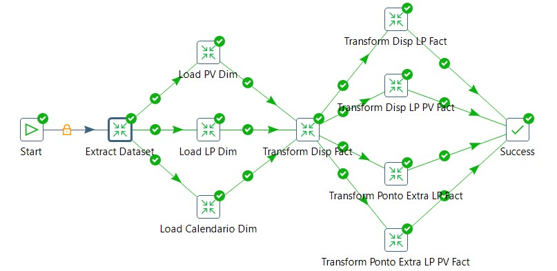

Bruno Baldez

bruno.behbc@gmail.com

# Teste Tecnico Data Engineer

## Pentaho Data Integration (PDI)
Para responder às questões 8, 9 e 10 utilize a ferramenta Pentaho Data Integration (PDI) na versão de sua preferência. 

A ETL final deve conter um job principal que, por sua vez, deve conter as transformações criadas nas questões 8, 9, 10. 

Além disso, que tal ganhar um ponto a mais nessas questões ? 
Para isso, inclua o projeto criado em um repositório do Github (é importante que seja público para termos visibilidade, ok ?).
Compartilhe por aqui o link para o repositório.

Segue as questões:

Construa uma transformação que deve usar como datasource o dataset (DATASET_TESTE_DE.csv) que contém informações de coletas de dados nos ponto de vendas. 

### Database
`Um Database que adota uma modelagem dimensional
será o destino dos dados (database: involves), nele são criados diferentes
schemas (bronze, silver e gold) que contem tabelas com os dados resultantes das
consultas propostas para as dimensoes e fatos`

`Para criação do Database com suas tabelas
referir ao arquivo './sql/create_database.sql'`

### Dataset
`DATASET_TESTE_DE.csv`

### Datasource

'bronze.dataset_disponibilidade'
['id_dataset', 'id_ponto_venda', 'nome_ponto_venda', 'perfil_ponto_venda', 'data', 'id_linha_produto', 'nome_linha_produto', 'marca_linha_produto', 'tipo_coleta', 'valor']

`O dataset sera extraido do CSV
e carregado a um um nivel de entrada
do Database (schema: bronze) na tabela
desejada (table: dataset_disponibilidade)
que sera o datasource inicial para consultas`

### 8)
A ETL deve consultar o dataset e inserir, em uma base de dados (modelo dimensional), as informações coletadas, conforme as tabelas abaixo:

#### a) Dimensão Calendário (DIM_CALENDARIO):
Deve conter data, mês e ano da coleta

'silver.dim_calendario'
['data', 'data_dt', 'ano', 'mes', 'dia']

#### b) Dimensão Ponto de Venda (DIM_PDV):
Deve conter o id, nome e perfil do ponto de venda

'silver.dim_pdv'
['id_ponto_venda', 'nome_ponto_venda', 'perfil_ponto_venda']

#### c) Dimensão Linha de Produto (DIM_LINHA_PRODUTO):
Deve conter o id, nome e perfil da linha de produto

'silver.dim_linha_produto'
['id_linha_produto', 'nome_linha_produto', 'marca_linha_produto']

Construa uma transformação que deve usar como datasource o dataset (DATASET_TESTE_DE.csv) que contém informações de coletas de dados nos ponto de vendas.

`Para isso a tabela silver.fact_disponibilidade foi criada e
recebe os dados do dataset (DATASET_TESTE_DE.csv) apartir
da  tabela definida como datasource (bronze.dataset_disponibilidade)
e esses dados são validados de acordo com as dimensões criadas`

'silver.fact_disponibilidade'
['data', 'id_ponto_venda', 'id_linha_produto',
'tipo_coleta', 'valor','ano', 'mes', 'dia',
'nome_ponto_venda', 'perfil_ponto_venda',
'nome_linha_produto', 'marca_linha_produto']

### 9)
A transformação deve consultar o dataset e inserir, em uma base de dados (modelo dimensional), as informações coletadas, conforme as tabelas abaixo:

Obs: Os dados de “Disponibilidade” estão categorizados na coluna TIPO_COLETA com o valor “Disponibilidade”. A presença é contada sempre que no campo VALOR aparecer o valor “SIM”

#### a) Fato Disponibilidade (FT_DISPONIBILIDADE):
Deve conter os ids de ligação das tabelas de dimensões criadas na questão anterior e a quantidade de presenças de cada linha de produto no mês de Setembro/20.

'gold.fact_disp_lp'
['mes', 'nome_linha_produto', 'count_dias_presenca_linha_produto']

#### b) Fato Disponibilidade Agregada (FT_DISPONIBILIDADE_AGREGADA):
Deve conter os ids de ligação das tabelas de dimensões (Dimensão Calendário e Ponto de Venda) e a quantidade de presença de linhas de produto agrupadas por ponto de venda no mês de Setembro/20.

'gold.fact_disp_lp_pdv'
['mes', 'nome_ponto_venda', 'nome_linha_produto',
'count_dias_presenca_linha_produto']

### 10)
Construa uma transformação que deve usar como datasource o dataset (DATASET_TESTE_DE.csv) que contém informações de coletas de dados nos ponto de vendas. A transformação deve consultar o dataset e inserir, em uma base de dados (modelo dimensional), as informações coletadas, conforme as tabelas abaixo:

Obs: Os dados de “Ponto Extra” estão categorizados na coluna TIPO_COLETA com o valor “Ponto Extra”.

#### a) Fato Ponto Extra (FT_PONTO_EXTRA):
Deve conter os ids de ligação das tabelas de dimensões criadas na questão anterior e a soma de ponto extras de cada linha de produto no mês de Setembro/20.

'gold.fact_pe_lp'
['mes', 'nome_linha_produto', 'sum_pontos_extras']

#### b) Fato Ponto Extra Agregada (FT_PONTO_EXTRA_AGREGADA):
Deve conter os ids de ligação das tabelas de dimensões (Dimensão Calendário e Ponto de Venda) e a soma de ponto extras de linhas de produto agrupadas por ponto de venda no mês de Setembro/20.

'gold.fact_pe_lp_pdv'
['mes', 'nome_ponto_venda', 'nome_linha_produto', 'sum_pontos_extras']

### Job Principal
A ETL final deve conter um job principal que, por sua vez, deve conter as transformações criadas nas questões 8, 9, 10.

