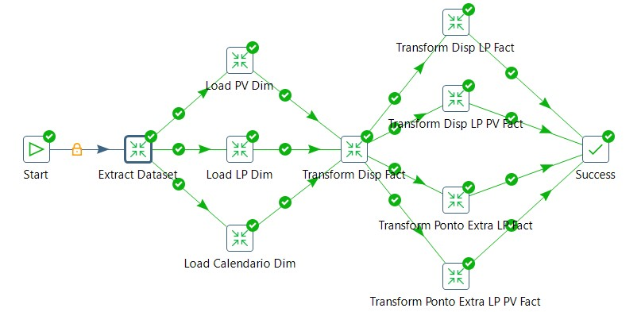

Bruno Baldez

bruno.behbc@gmail.com

## Pentaho Data Integration Project

### Database

No diretorio `./sql` esta localizado o sql (`create_database_involves.sql`)
que ao ser executado criara as tabelas necessarias para a integração.

### Job principal

No diretorio `./jobs` esta localizado o job principal (`integration_job.kjb`)
responsavel por orquestrar todas as transformações necessárias para integrar 
os dados desde a camada de entrada até a camada final do Database 

 

